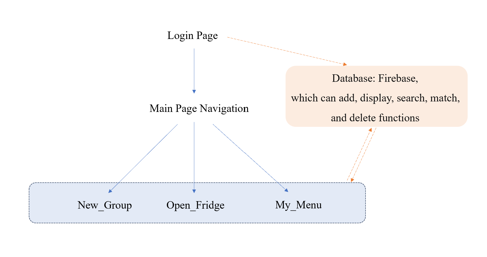

```markdown


# Shared Refrigerator Management System----Database

## Overview  
This system leverages Firebase Realtime Database to manage shared refrigerator data for group users, supporting real-time synchronization and multi-device collaboration. It provides core functionalities for food management, group coordination, and recipe sharing, with isolated data storage between different user groups.

## Features

### 1. Multi-User Group Management
- **Group Creation**: Users can create groups and invite members via UID
- **Cross-Group Support**: Users can join/leave multiple groups while maintaining independent data for each group
- **Auto-Sync**: Group member changes (join/leave) trigger real-time updates across all devices

### 2. Collaborative Food Tracking
- **Ownership Control**: Each food item supports multiple owners (e.g., roommates sharing groceries)
- **Expiry Alerts**: Stores expiration dates and storage conditions (refrigerated/frozen)
- **Batch Operations**: Bulk insertion and deletion of food items with transaction safety

### 3. Shared Recipe Database
- **Ingredient Mapping**: Recipes automatically link to existing food items in the group
- **Cooking Guide**: Step-by-step instructions with collaborative editing capability

## Components

### 1. Data Models

#### Core Data Structures
| Model       | Key Fields                          | Description                                  |
|-------------|-------------------------------------|----------------------------------------------|
| `FoodItem`  | Name, Owners, Expiry, Storage, Price| Tracks shared groceries with ownership       |
| `MenuItem`  | Name, Ingredients, Steps            | Group-shared recipes                         |  
| `Group`     | GroupID, Members, MemberCount       | Manages user collaboration units             |

### 2. Database Structure
```tree
firebase-database/
├── foods/               # Group-specific food storage
│   └── {groupID}/       
│       └── {foodID}     
├── menus/               # Shared recipe pool
│   └── {groupID}/       
├── groups/              # Group metadata
│   └── {groupID}/       
│       └── members/     # Member UID list  
└── user_groups/         # User-group relationships
    └── {userID}/        
        └── {groupID}    # Tracks user's joined groups
```

## Implementation Details

### 1. Real-Time Synchronization
- **Live Data Binding**: UI components automatically refresh when food/recipe data changes
- **Conflict Resolution**: Firebase handles concurrent edits through timestamp-based version control

### 2. Security Controls
- **Data Isolation**: Users can only access data from groups they join
- **Ownership Verification**: Food deletion requires owner authorization

### 3. Modular Design
- **DatabaseHelper Class**: Unified API for all CRUD operations (e.g., `addFood()`, `joinGroup()`)
- **Callback Interface**: Asynchronous results handling via `FirebaseCallback<T>`

## Configuration Guide

### 1. Firebase Setup
1. Create project in [Firebase Console](https://console.firebase.google.com/)
2. Enable Realtime Database with security rules for group-based access

### 2. Android Integration
1. Add `google-services.json` to project
2. Initialize Firebase SDK in Application class

### 3. Testing
1. Use `TestActivity` to validate core operations:
   - Insert sample food/group data
   - Simulate multi-user collaboration scenarios

This design optimizes shared resource management for student dorms, coworking spaces, and family households.


# User Session Management

## Overview
Handles the user's logged-in state and stores essential identifiers locally. It ensures a seamless experience by remembering the user and their group affiliation between app uses.

## Key Functionality
- **Session Creation**: Stores user ID and login status upon successful login.
- **Session Check**: Provides a method (`isLoggedIn()`) to check if a user session is active.
- **Session Termination**: Clears stored session data on logout (`logoutUser()`).
- **User/Group ID Storage**: Stores and retrieves the current `userId` and `groupId`.
- **Group Sync**: Automatically fetches and updates the user's `groupId` from Firebase after login (`updateGroupIdFromFirebase`).

## Usage Flow
- `MainActivity` checks `isLoggedIn()` on launch to decide whether to show the login screen or the main app page.
- Upon successful login, `createLoginSession()` is called.
- `getUserId()` and `getGroupId()` are used throughout the app to identify the current user and their group context.
- Logout functionality calls `logoutUser()`.

## Dependencies
- Android `SharedPreferences` for local storage.
- `DatabaseHelper` for fetching group information from Firebase.

# Group Management 

## Overview
Allows users to find, join, create, view details of, and leave groups. This facilitates collaboration within the application.

## Key Functionality
- **State-Dependent UI (`New_Group.java`)**:
    - Displays options to search/create groups if the user is not in one (`no_group_container` in `activity_new_group.xml`).
    - Displays current group info and a "View Details" button if the user is in a group (`has_group_container`).
- **Group Search**: Users can search for existing groups by ID. Results shown in a RecyclerView (`recycler_search_results`).
- **Group Creation**: Users can create a new group with a unique ID. The creator automatically joins the group.
- **Joining Groups**: Users can join a group found via search (with confirmation).
- **Viewing Group Details (`GroupDetailsActivity.java`)**:
    - Displays the group ID and member count (`activity_group_details.xml`).
    - Lists all members of the group in a RecyclerView (`recycler_members`).
- **Leaving Groups**: Users can leave their current group from the `GroupDetailsActivity`.

## Usage Flow
- User navigates to the Group Management screen (`New_Group`).
- **If not in a group:**
    - User can enter a group ID and search. Results appear, user can tap to join (confirmation shown).
    - OR User can enter a new group ID and tap "Create".
- **If in a group:**
    - User sees their group ID and member count.
    - User can tap "View Details" to navigate to `GroupDetailsActivity`.
    - In `GroupDetailsActivity`, user sees member list and can tap "Leave Group" (confirmation shown). Leaving clears the group from `UserSession` and returns to `New_Group`.

## Dependencies
- `UserSession` to get current user ID and manage group ID storage.
- `DatabaseHelper` for all Firebase group operations (create, search, join, leave, get members, check membership).
- `GroupAdapter` & `MemberAdapter` for displaying group/member lists in RecyclerViews.
- `activity_new_group.xml` & `activity_group_details.xml` for the respective UIs.


# OpenFridge Food Management System

## Overview
The OpenFridge module provides a user-friendly interface for managing food inventory within group settings. It features real-time food listing with expiration alerts, intuitive search functionality. Built with Firebase Realtime Database and Android Jetpack components, it ensures efficient data synchronization and responsive UI interactions.

## Key Functionality

| Functional module    | Corresponding page | Core capabilities                                        |
| -------------------- | ------------------ | -------------------------------------------------------- |
| Food list management | Open_Fridge.java   | List display/search/expiration warning/deletion          |
| Food addition        | add_food.java      | Form verification/group member selection/data submission |

## Component Details

### Food Inventory Management

The **Food Inventory Management** system provides a real-time, group-based view of all stored food items. It displays food details (name, expiry, storage, price, owners) in a scrollable list, with **visual warnings** for items nearing expiration (≤3 days). Users can **search**, **filter**, and **delete** items, with all changes synchronized instantly via Firebase.


#### Key Functionality

- **Food List Display**: Shows all food items in a scrollable RecyclerView with detailed information including name, expiry date, and storage method.
- **Smart Search**: Filters food items in real-time as users type, with case-insensitive matching for quick retrieval.
- **Expiry Alerts**: Highlights items expiring within 3 days in red for immediate visibility.
- **Delete Food**: Implements secure deletion with confirmation dialog and database transaction.
- **Data Sync**: Automatically refreshes the food list when returning to the screen via onResume().
- **Group Filtering**: Only displays food items belonging to the current user's group.


#### Usage Flow

- Initialization:
  - `Open_Fridge` checks Firebase authentication state on launch to determine if user should be redirected to login.
  - Upon successful login, the food list automatically refreshes via `loadFoodData()` in `onResume()`.
- User Interactions:
  - Search: Typing in `EditText` triggers `applyFilter()` for real-time updates
  - Delete:
    - Click delete icon → Shows `MaterialAlertDialog` for confirmation
    - On confirm → Calls `DatabaseHelper.deleteFood(groupId, foodId)`
- Data Sync:
  - Automatically refreshes on `onResume()`
  - Listens to Firebase changes via `ValueEventListener`


### Add Food Management

The **Add Food Management** system enables users to securely add new food items to their group's inventory. It features a **validated form** with dynamic group-based owner selection, ensuring only authorized members can assign ownership.

#### Key Functionality

- **Add New Food**: Provides a form with validation, date picker, and group-based owner selection.
  - **Form Validation**: Mandatory fields (name, expiry, price) with real-time feedback.
  - **Smart Owner Selection**: Dropdown menu populated with current group members (via Firebase).
  - **Date Picker**: Restricts expiry dates to future-only selections.
  - **Storage Method**: Radio buttons for Freezing/Refrigeration/Room Temp.
- Auto-refreshes inventory list on successful submission.


#### Usage Flow

- Initialization:
  - `add_food.java` loads the current user's `groupId` from `UserSession`
  - Fetches group members via `DatabaseHelper.getGroupMembers(groupId)`

- User Input:
  - Form Completion:
    - Name/Price: Text input with validation (`TextWatcher`)
    - Expiry: Date picker (minDate=today)
    - Owners: Multi-select dialog with chip display
  - Submission:
    - Validates all fields → Shows errors if incomplete
    - On success: Calls `DatabaseHelper.addFood()` → Returns to `Open_Fridge`


## Dependencies

- Core Dependencies:

  - Firebase Realtime Database - Stores and synchronizes all food item data in real-time

  - Firebase Authentication - Handles user login state and session management

  - AndroidX Components


- App-Specific Modules:
  - UserSession - Manages current user's login state and group context
  - DatabaseHelper - Abstracts all Firebase database operations (CRUD)
  - FoodAdapter - Handles food list rendering and interaction logic


# Menu Management System

## Overview
This documentation covers the Menu Management functionality developed for the group project Android application. The system enables users to create and manage menu items within their groups, with features for adding new menu items and checking recipe readiness based on available ingredients.

## Features
- **Add Menu Item**: Users can create new menu items with ingredients and preparation steps
- **Menu Display**: Users can view all menu items across their groups
- **Recipe Readiness**: The system checks if all ingredients for a recipe are available
- **Group-Based Menu Management**: Menu items are associated with specific user groups

## Components

### 1. Add Menu Feature (`add_menu.java`)

#### Description
This component allows users to create and add new menu items to their groups. Users can specify a menu name, ingredients, and preparation steps.

#### Key Functionality
- Validates that users are logged in before accessing the feature
- Retrieves and displays the user's groups as radio button options
- Allows users to input menu details including:
    - Menu name
    - Ingredients (comma-separated)
    - Preparation steps
- Validates that all required information is provided
- Adds the menu item to the selected group in the database

#### Usage Flow
1. User selects a group from the available options
2. User enters menu name, ingredients (comma-separated), and steps
3. User clicks "Add Menu" button
4. System validates the input and adds the menu to the database
5. User receives confirmation of successful addition

#### Dependencies
- Firebase database for storing menu items
- UserSession for managing login state
- DatabaseHelper for database operations

### 2. My Menu Feature (`My_Menu.java`)

#### Description
This component displays all menu items available across the user's groups and checks their readiness based on available ingredients.

#### Key Functionality
- Validates that users are logged in before accessing the feature
- Retrieves all menu items from all groups the user belongs to
- Retrieves all food items owned by the current user
- Checks which menu items are "ready" based on ingredient availability
- Displays menu items with readiness status using a custom adapter

#### Usage Flow
1. System automatically retrieves and displays menu items when the activity is opened
2. Users can see which recipes they can make with their current ingredients
3. Users can navigate to the Add Menu screen by clicking a button

#### Recipe Readiness Logic
The system determines if a recipe is ready to be prepared by:
1. Comparing each ingredient in the recipe with the user's available food items
2. Marking a recipe as "ready" only if all required ingredients are available

#### Dependencies
- Firebase database for retrieving menu and food items
- UserSession for managing login state
- DatabaseHelper for database operations
- MenuAdapter for displaying menu items

## Database Structure
The system interacts with the following database collections:
- **Groups**: Contains information about user groups
- **Menus**: Stores menu items associated with specific groups
- **Foods**: Stores food items with owner information

## Implementation Details

### Add Menu Implementation
- The system uses RadioButtons dynamically generated based on the user's group memberships
- Ingredients are parsed from a comma-separated string into a List
- Menu items are stored with a reference to the selected group

### My Menu Implementation
- The system retrieves menus from all groups the user belongs to
- Duplicate menu items are filtered out to prevent showing the same menu multiple times
- The checkMenuItemsReadiness method determines recipe readiness by comparing ingredients to available food items

## Error Handling
- Toast messages provide feedback for:
    - Authentication issues (not logged in)
    - Incomplete menu information
    - Group selection requirements
    - Database operation success/failure

```